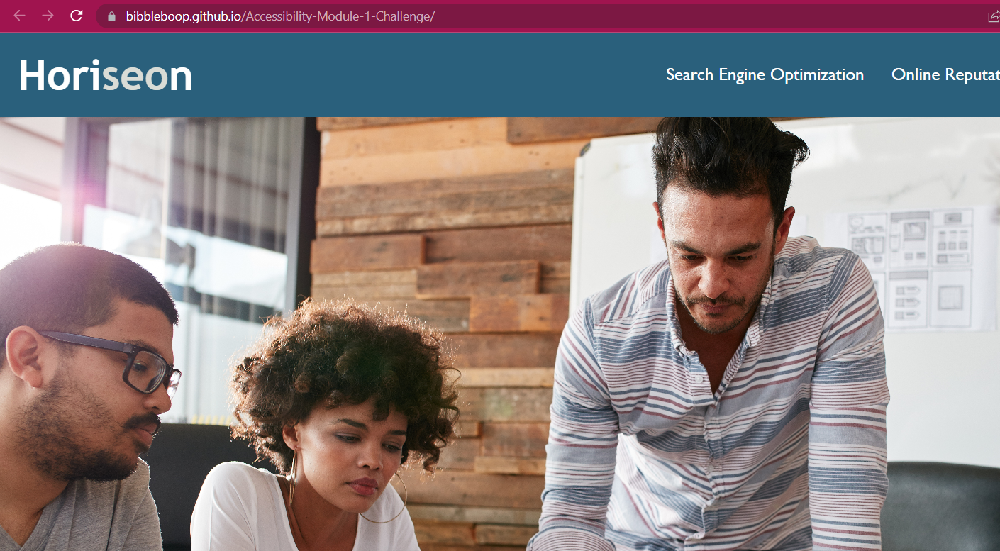

#Module 1 Challenge Accessibility

**HTML CSS Git Challenge: Code Refractor**

The starter code has been refactored to meet the requirements in the challenge user story and acceptance criteria.

For this challenge the following have been used and referred to for assistance and guidance.

  

Bootcampspot - Class Slides - Class Zoom recordings - Week 1 Module guide - Week 1 Activies - Office hours

VSCode and Markdown have also been used and their guidance taken on board from the following links:

                - [Mastering Markdown](https://guides.github.com/features/mastering-markdown/).

                - [the VSCode repository](https://github.com/microsoft/vscode).

---

© 2022 edX Boot Camps LLC. Confidential and Proprietary. All Rights Reserved.
$$
